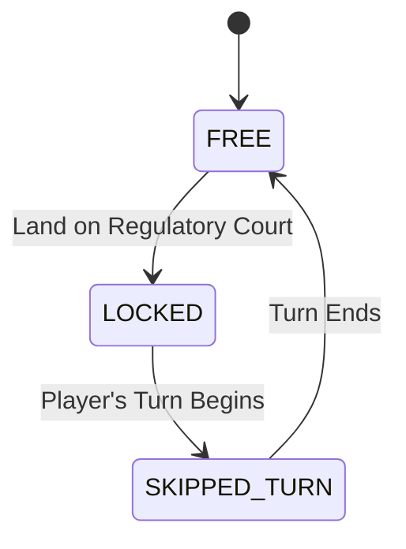
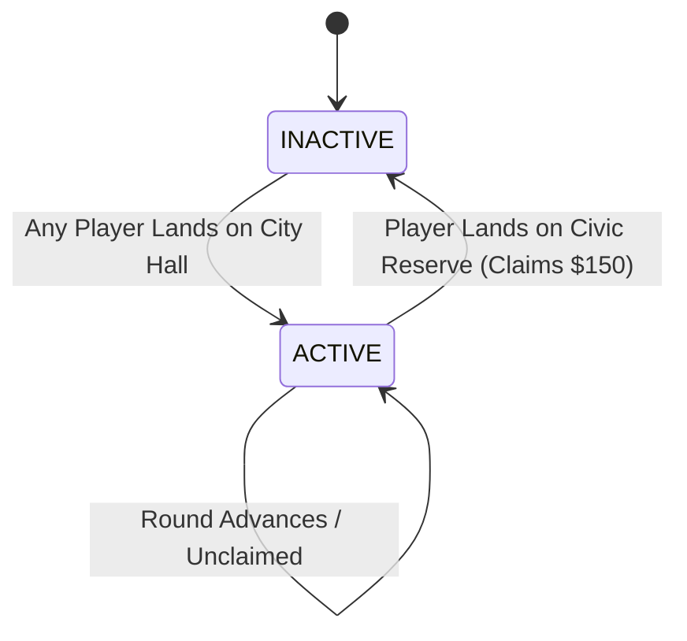

# SPECIAL SPACES SYSTEM

## Document Status
**Status:** LOCKED FOR GAME DESIGN

## Purpose
The Special Spaces System defines the authoritative gameplay mechanics for every non-property special space in The Daily Ledger. These spaces provide critical infrastructure, municipal interaction, information, and regulatory boundaries that complement the core property economy. They resolve the missing mechanics from the original board design without introducing bloated sub-games.

## Design Philosophy
1. **BOARD IS THE GAME:** Special spaces exist on the board and are triggered by physical board presence.
2. **SPECIAL SPACES MUST HAVE DISTINCT PURPOSES:** A transport node is not a news desk; a regulatory court is not a bank.
3. **INFORMATION SHOULD CREATE DECISIONS, NOT INSTRUCTIONS:** Information spaces inform the player about the city's state; they do not force the player's strategy.
4. **TRANSPORT SHOULD CREATE POSITIONAL CHOICES:** Moving across the board allows repositioning for defense or offense.
5. **FINANCIAL SPACES SHOULD INTERACT WITH THE EXISTING ECONOMY:** Grants and levies respect existing liquidity constraints.
6. **CIVIC HOLD SHOULD CREATE TEMPORARY OPPORTUNITY COST, NOT REMOVE A PLAYER FROM THE GAME:** Missing a turn is the penalty; players do not lose their assets or agency over existing properties.
7. **NO NEW CURRENCY:** All financial interactions use standard cash.
8. **NO VP / NO REPUTATION / NO INFLUENCE:** Mechanics remain strictly economic and positional.
9. **NO DEBT:** The game enforces hard liquidity boundaries.
10. **NO SEPARATE SPECIAL-SPACE DECKS:** Unless explicitly leveraging the existing Market or News systems.
11. **NO DIRECT PLAYER-CONTROLLED MARKET MANIPULATION:** Special spaces do not let a player manually change sector indices.
12. **SPEED:** Mechanics resolve quickly to support a 20–30 round digital game.

## Space Registry

**INFORMATION:**
*   05 City Desk
*   30 Velora Bourse (Defined in MARKET_SYSTEM.md)
*   31 Market Desk
*   34 Foreign Desk
*   36 Property Desk

**TRANSPORT:**
*   15 Velora Port
*   32 Central Metro
*   35 Aerodrome Link
*   37 Eastern Rail Terminal

**CIVIC / FINANCIAL:**
*   20 City Hall
*   25 Municipal Levy (Defined in ECONOMY_SYSTEM.md)
*   33 Treasury Window
*   39 Civic Reserve

**REGULATORY:**
*   10 Civic Hold
*   38 Regulatory Court

## Information Space System

The four information spaces act as an Information Network, surfacing the city's state without altering it.

### City Desk
**Function:** Provides current civic and world information.
**Mechanic:** Upon landing, the player receives a contextual summary of the latest `CONFIRMED` civic events from the `NEWS_SYSTEM.md` (e.g., recent Flagship constructions, bankruptcies, or district control changes).
**Visibility:** Public information presented directly to the landing player. If no recent stories exist, it provides a generic "City is quiet" localized flavor text.

### Market Desk
**Function:** Provides CURRENT PUBLIC MARKET INFORMATION.
**Mechanic:** Displays a detailed breakdown of the authoritative market state, including all six sector indices, their current status (e.g., DISTRESSED, STABLE, BOOM), and the most recently resolved market movement. 
**Constraint:** It MUST NOT reveal the *next* unresolved Market Pulse. That is strictly the domain of Velora Bourse.

### Foreign Desk
**Function:** Provides forward-looking external information.
**Mechanic:** Upon landing, the player receives an `OUTLOOK` or `RUMOR` (as defined in `NEWS_SYSTEM.md`) concerning a specific sector or board condition. 
**Constraint:** It does not guarantee a specific card draw, nor does it directly change a Market Index. It provides narrative hinting for broader market trends.

### Property Desk
**Function:** Provides PROPERTY INTELLIGENCE.
**Mechanic:** The player selects any single property on the board. The UI displays its complete authoritative state: Owner, Asking Price, Market Value, Current Yield, Primary/Secondary Sectors, Development state, and relevant market condition modifier. 
**Constraint:** This does not trigger an appraisal mini-game or force a transaction. It uses existing authoritative data to inform trading or acquisition strategies.

### Velora Bourse Integration
`VELORA BOURSE` (Space 30) remains authoritative as defined in `MARKET_SYSTEM.md`: It allows the landing player to privately inspect the *next* unresolved Market Pulse card. 
**Distinction:** Market Desk = What has happened. Velora Bourse = What will happen next.

## Transport Network

### Network Topology
The Transport Network consists of four symmetrically placed nodes: Velora Port (15), Central Metro (32), Aerodrome Link (35), and Eastern Rail Terminal (37). Every node connects equally to all other nodes in a fully open undirected graph.

### Transport Resolution
Upon landing on any Transport node, the player is presented with an **OPTIONAL** choice to relocate their piece to any of the other three Transport nodes.
*   Travel is free (no currency consumed).
*   If the player chooses to travel, their piece is placed on the destination node.
*   **No Chaining:** Arriving at the destination node does *not* trigger the destination node's landing effect again, nor does it allow another jump.
*   **Direct Movement:** Transport movement is direct and non-linear. It does NOT cross intermediate spaces. Moving from Aerodrome Link (35) to Velora Port (15) bypasses Velora Central (00) and does NOT trigger the $225 dividend.

### Node Definitions
Transport nodes do not belong to districts and cannot be purchased, developed, or traded. They exist purely as positional utility.

## Civic Financial System

### City Hall
**Function:** MUNICIPAL ADMINISTRATION.
**Mechanic:** Landing on City Hall activates the `Civic Reserve`.
*   If the Civic Reserve is `INACTIVE`, its state changes to `ACTIVE`. 
*   If the Civic Reserve is already `ACTIVE`, landing on City Hall has no additional effect.
*   City Hall activation is limited to once per round. A new activation cannot occur until the existing activation has been claimed, consistent with the existing rules.
*   Activation is public and announced on the Telegraph Wire.

### Treasury Window
**Function:** LIMITED LIQUIDITY SUPPORT.
**Mechanic:** A municipal grant system for players facing liquidity pressure.
*   **Eligibility:** The landing player's cash eligibility is evaluated immediately when the Treasury Window landing resolves, before any later mandatory payment or liquidity resolution caused by that landing. The player must have current cash strictly less than the Low-Cash Threshold (CALIBRATION VALUE: $300).
*   **Effect:** The player receives a municipal allocation (CALIBRATION VALUE: $150).
*   **Constraints:** Optional use. Can only be claimed once per landing. Does not cost anything. Is not a loan. Does not require collateral. Cannot be claimed if cash is $\geq$ $300. Cannot be used to resurrect a bankrupt player.

### Civic Reserve
**Function:** MUNICIPAL OPPORTUNITY.
**Mechanic:** A first-come, first-served municipal payout.
*   **State:** Starts `INACTIVE`. Becomes `ACTIVE` when any player lands on City Hall.
*   **Claiming:** If a player lands on Civic Reserve while it is `ACTIVE`, they automatically claim the distribution (CALIBRATION VALUE: $150).
*   **Reset:** Upon being claimed, the state immediately reverts to `INACTIVE`.
*   **Persistence:** Once activated by City Hall, the Civic Reserve remains active across round boundaries until a player claims it. It does NOT expire merely because the round ends.

### Municipal Levy Integration
As defined in `ECONOMY_SYSTEM.md`, Municipal Levy (25) deducts 8% of current cash (min $40, max $180). This space enforces a mandatory payment resolution. If a player lacks the cash, it immediately triggers the Liquidity Resolution state defined in `FINANCE_SYSTEM.md`.

## Civic Hold

### Visiting Civic Hold
Space 10 is the physical location of Civic Hold. Landing on Space 10 via a normal dice roll or transport is simply a "Visit." Nothing negative happens. The player acts normally.

### Forced Entry
A player is strictly sent to Civic Hold (and marked as `Locked`) when:
1. They land on Regulatory Court (Space 38).
2. (Future expansion: specific Market Shocks or Event cards, if implemented).
When sent to Civic Hold, movement is direct. The player does not pass Velora Central (00) and receives no dividend.

### Locked State
A `Locked` player suffers a temporary opportunity cost:
*   They miss exactly ONE complete normal turn.
*   During their locked turn, they do NOT roll the dice and do NOT move.
*   They cannot initiate trades, build developments, or participate in Auctions.
*   They cannot use Transport.

### Release
At the end of the skipped turn, the `Locked` status is cleared. On their subsequent turn, the player rolls and moves normally from Space 10.

### Economic Continuity
Being Locked restricts *agency*, not *ownership*:
*   Properties remain owned.
*   Rents are still collected if others land on their properties.
*   Market Pulse effects continue to apply to their portfolio, and mandatory obligations defined by authoritative systems still apply.
*   Market Value fluctuations continue to affect their portfolio.

### Interaction Rules
*   A locked player can be targeted by trade proposals, but cannot actively initiate them. (They may accept trades if it resolves a Liquidity Crisis).
*   If an effect instructs a Locked player to move to Civic Hold again, the duration does NOT stack.

## Regulatory Court
**Function:** Immediate Regulatory Enforcement.
**Mechanic:** Landing on Space 38 ends the player's current movement immediately. The player's piece is moved directly to Space 10 (Civic Hold), and their state is set to `Locked`.
**Telegraph Wire:** A public notification is broadcast (e.g., "[PLAYER] remanded to Civic Hold by Regulatory Court").

## Special-Space Turn Resolution

The authoritative execution order for landing on a special space:

1. **MOVE:** Player arrives at destination index.
2. **IDENTIFY SPACE:** Check if space is Property or Special.
3. **CHECK FOR FORCED STATE:**
   * If Regulatory Court -> Move to Civic Hold -> Set `Locked` -> Proceed to Turn End.
4. **RESOLVE SPECIAL SPACE (If applicable):**
   * If City Hall -> Set Civic Reserve `ACTIVE`.
   * If Civic Reserve (`ACTIVE`) -> Add $150 -> Set `INACTIVE`.
   * If Treasury Window -> Check eligibility -> Add $150 (if claimed).
   * If Information Desk -> Display relevant UI panel.
   * If Transport -> Prompt optional relocation -> Move piece (do not re-trigger destination).
5. **RESOLVE MANDATORY PAYMENT (If applicable):**
   * If Municipal Levy -> Calculate Levy -> Pay City OR trigger Liquidity Resolution.
6. **OPTIONAL ACTIONS:** Execute allowed Developments or Trades.
7. **END TURN.**

## State Machines

### Civic Hold State

### Civic Reserve State

## Multiplayer / Server Authority
The server holds ultimate authority over special spaces:
*   **Validation:** The server validates transport destination legality (must be one of the other 3 nodes).
*   **Civic Reserve:** The server tracks `ACTIVE`/`INACTIVE` state. Concurrent landings (impossible in sequential turns, but relevant for potential future async effects) are resolved sequentially.
*   **Treasury Window:** The server validates cash < $300 before authorizing the $150 grant. Clients cannot artificially request this grant.
*   **Civic Hold:** The server strictly skips the `ROLL` and `MOVE` phases for a `Locked` player, auto-advancing their turn after standard upkeep.

## News Integration
Special spaces naturally populate the Telegraph Wire (lightweight logs) rather than full Breaking News takeovers.
*   *City Hall:* "City Hall activates Civic Reserve funds."
*   *Civic Reserve:* "[PLAYER] claims the Civic Reserve."
*   *Regulatory Court:* "[PLAYER] remanded to Civic Hold."
Information desks (City, Foreign) read from the News System but do not inherently generate new broadcast events.

## UI Requirements
*   **Contextual Panels:** When landing on an Information space, a localized panel opens in the sidebar or screen center. It is dismissible.
*   **Transport Selector:** Landing on transport highlights the other three transport spaces on the board UI as clickable destinations, alongside a "Stay Here" button.
*   **Hold Status:** A `Locked` player has a distinct visual indicator (e.g., handcuffs icon or a lock over their avatar).
*   **Civic Reserve Status:** Space 39 visually glows or displays an indicator when in the `ACTIVE` state.

## Edge Cases

*   **Transport Crossing Velora Central:** Direct transport movement calculates distance via abstract non-linear space; it never crosses index 00, hence no $225 dividend.
*   **Multiple City Hall Landings:** If Civic Reserve is `ACTIVE`, subsequent City Hall landings are ignored.
*   **Bankrupt Player properties:** Property Desk can view them, but they will explicitly show as "Unowned."
*   **Treasury Window at exactly $300:** Not eligible. Must be strictly less than $300.
*   **Disconnected Player at Transport:** A bot taking over will default to "Stay Here" to maintain deterministic simplicity.
*   **Final Round Freeze:** Special spaces still resolve normally (Information desks load state, Treasury dispenses cash) but they do not cause secondary market changes.
*   **Civic Reserve at End of Game:** Remains unclaimed. It is not paid out as a dividend to all players.

## Balance and Calibration

The following values are provisional and explicitly marked for **CALIBRATION REQUIRED** during playtesting:
*   **Treasury Window Threshold:** $300 (Relative to $1,800 starting cash and average rent ranges).
*   **Treasury Window Allocation:** $150.
*   **Civic Reserve Distribution:** $150.
*   **Civic Hold Duration:** Miss exactly ONE full normal turn.

These values ensure that liquidity constraints remain meaningful while providing a limited safety net against early elimination, without turning municipal spaces into infinite money loops.

## Research Basis

Mechanisms were designed to support The Daily Ledger's core economy:
*   **Temporary Movement Restriction:** The Daily Ledger restricts positional agency without removing economic agency. Players maintain the ability to collect rent and benefit from portfolio valuation, ensuring they remain engaged with the core economy during Civic Hold.
*   **Transport Networks:** Transport spaces are designed purely for positional utility rather than rent generation, providing strategic options for late-game board traversal without injecting arbitrary cash into the economy.
*   **Information vs. Action:** By defining specific board spaces for information gathering, The Daily Ledger converts market analysis into a deliberate tactical board action rather than a passive menu interaction.
*   **Liquidity Safety Nets:** The Treasury Window provides a limited municipal safety net to ease temporary bottlenecks, while enforcing a strict cash threshold to maintain meaningful liquidity constraints for wealthy leaders.

## Dependencies

**Depends on:**
*   `BOARD_ARCHITECTURE.md` (Board Layout)
*   `MARKET_SYSTEM.md` (Velora Bourse, Market Indices)
*   `ECONOMY_SYSTEM.md` (Municipal Levy, Dividends)
*   `NEWS_SYSTEM.md` (Outlooks, Rumors)
*   `FINANCE_SYSTEM.md` (Liquidity Resolution)

## Authority Rules

`SPECIAL_SPACES_SYSTEM.md` is the authoritative source for the gameplay mechanics of non-property special spaces.

If a special-space rule touches another system (e.g., Municipal Levy touching the economy, or Velora Bourse touching the market), the other system remains authoritative for that system's underlying mechanics.

## Explicitly Out of Scope
*   No new currencies, tickets, or transport tokens.
*   No new decks of cards for City Hall or Regulatory Court.
*   No permanent player stat changes (e.g., criminal records or political influence).
*   No direct manipulation of property ownership via Civic spaces.

## Consistency Audit
*   **Currency:** Verified. No new currencies introduced. Uses standard cash.
*   **Market Manipulation:** Verified. Desk spaces only *read* information.
*   **Velora Central Dividend:** Verified. Transport and Regulatory Court movement do not trigger the dividend.
*   **Civic Hold Rules:** Verified. Player maintains economic agency (rents/market) but loses positional/turn agency.
*   **Property Registry:** Verified. No overlap with P01-P24.

---
**Document Status: SPECIAL SPACES SYSTEM v1 — LOCKED FOR GAME DESIGN**
