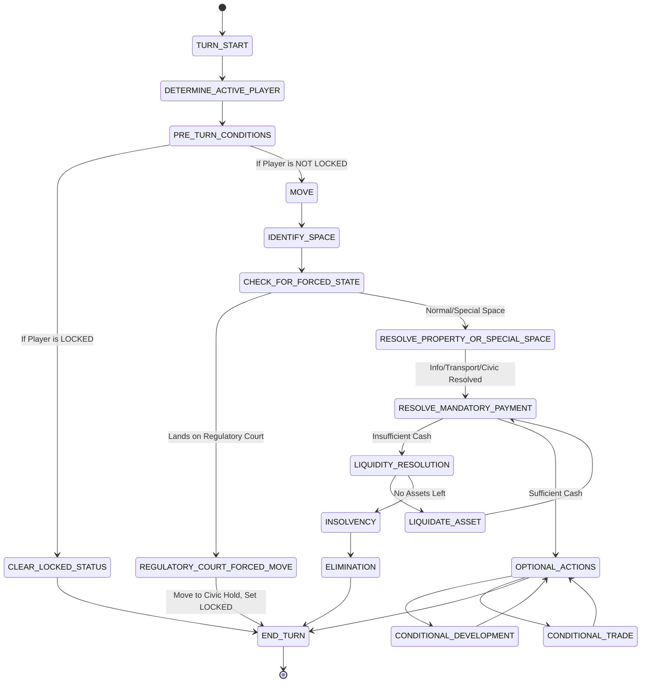
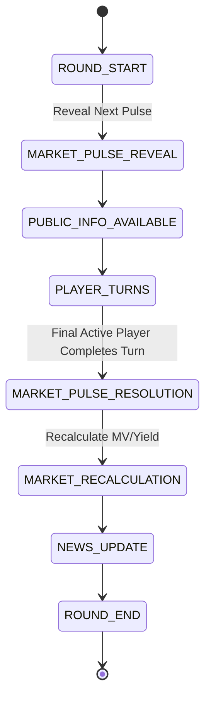

# SOFTWARE REQUIREMENTS SPECIFICATION
## The Daily Ledger

## 1. Document Control
*   **Document Name:** Software Requirements Specification: The Daily Ledger
*   **Version:** 1.2
*   **Status:** SRS v1.2 — IMPLEMENTATION SPECIFICATION
*   **Purpose:** To translate the locked game design into a precise, implementation-ready Software Requirements Specification (SRS).
*   **Design Source Documents:** BOARD_ARCHITECTURE.md, PROPERTY_SYSTEM.md, PROPERTY_CATALOGUE.md, ECONOMY_SYSTEM.md, DEVELOPMENT_SYSTEM.md, MARKET_SYSTEM.md, DISTRICT_CONTROL.md, NEWS_SYSTEM.md, PLAYER_INTERACTION.md, AUCTION_SYSTEM.md, FINANCE_SYSTEM.md, FLAGSHIP_DESIGN.md, ENDGAME_AND_BALANCE.md, SPECIAL_SPACES_SYSTEM.md.
*   **SRS Authority:** Derived strictly from the authoritative locked design hierarchy.

## 2. Project Overview
The Daily Ledger is a browser-first multiplayer board game set in Velora City. It combines a physical board layer with a newspaper information system, property acquisition, district control, development, trading, and quick auctions. Financial pressure is driven by market shifts, rent, and municipal levies. The game ends decisively at a target round limit or when all but one player is bankrupt, culminating in a Final Edition showing the highest Final Wealth.

## 3. Scope
**IN SCOPE FOR POC/MVP:**
*   Server-authoritative multiplayer board game (2–4 players).
*   40-space board, 24 properties across 6 districts, 16 special spaces.
*   Core economy: $1800 starting cash, property acquisition, 50% Asset Base liquidation, bankruptcy.
*   Development Engine: 32 standard projects (Cashflow/Resilience) and 6 Flagships.
*   Market Engine: 6 Sectors, Market Pulse Deck (Trend, Shock, Reversal), Resilience.
*   District Control: Ownership progression, +5% yield, Development Network.
*   Trading: Atomic proposal/execution system for cash and properties.
*   Auctions: Quick Auction (single sealed bid) with 50% minimum bid.
*   News Engine: Telegraph Wire, Breaking News, Final Edition templates.
*   Special Spaces: Information Network, Transport Network, Civic Financial System, Civic Hold.

**OUT OF SCOPE:**
*   Debt, player loans, mortgages, or complex credit instruments.
*   Victory Points, influence, reputation, or prestige systems.
*   Stock trading, commodities, multiple currencies, or maintenance fees.
*   AI-generated long-form journalism.
*   Diplomacy minigames, future promises, or contracts.
*   Ascending live auctions or multi-round bidding.
*   3D rendering, complex unit animations.

## 4. Terminology
*   **Round:** Completes when every active player has taken one normal turn.
*   **Turn:** The active player's execution sequence.
*   **Active Player:** The player whose turn it currently is.
*   **Property:** One of the 24 purchasable board assets.
*   **Asking Price:** The fixed base cash cost to acquire an unowned property.
*   **Market Value:** The paper wealth value of a property = ROUND(Asset Base × Exposure Index ÷ 100).
*   **Yield:** The recurring income generated when another player lands on a property.
*   **Base Yield:** Baseline yield derived from the property tier percentage of Asking Price.
*   **Current Yield:** Final resolved yield = Base Yield × Development × Market × District.
*   **Asset Base:** Asking Price + Capitalized Development Value (75% of development cost).
*   **Development:** A physical asset added to a property slot (Cashflow or Resilience).
*   **District:** A predefined collection of 4 specific properties.
*   **Control:** Ownership of 4/4 properties (+5% yield, Network, Flagship eligible).
*   **Market Index:** The current baseline score (starts at 100) for a specific sector.
*   **Market Pulse:** An event card (Trend, Shock, Reversal) altering a Market Index.
*   **Exposure Index:** The blended property vulnerability (70% Primary + 30% Secondary).
*   **Flagship:** The ultimate 4/4 district development, replacing standard slots. Provides +100% Base Yield (additive replacement).
*   **Minimum Bid:** The absolute floor for a Quick Auction (50% of Asking Price).
*   **Liquidity Resolution:** A temporary game state where a player must raise cash to pay a mandatory obligation.
*   **Insolvency / Bankruptcy:** When a player exhausts all liquidity options and cannot pay; triggers elimination.
*   **Final Wealth:** Cash + Current Market Value of owned properties at game end.
*   **LOCKED:** A temporary status where a player misses one complete normal turn, restricting positional agency while preserving economic agency.
*   **Civic Reserve:** A municipal opportunity that, when ACTIVE, grants $150 to the first player to land on it.
*   **Treasury Window:** A liquidity safety net granting an optional $150 to eligible players.

## 5. System Architecture
The system shall employ a strict separation of concerns, heavily prioritizing a server-authoritative state model.

**Modules:**
*   **Client/UI:** Visual rendering, interaction, UI state. Board is primary; Sidebar handles decisions.
*   **Game State Controller:** The centralized source of truth holding the authoritative state object.
*   **Rules Engine:** Validates all state transitions and player inputs.
*   **Turn/Phase Controller:** Manages the sequential turn state machine and blocks async actions during resolution.
*   **Economy Engine:** Handles cash creation (dividends), destruction (levies/auctions), and transfers.
*   **Market Engine:** Resolves Market Pulses, manages indices, calculates Market Value/Current Yield.
*   **Property & District Engine:** Manages ownership, tracks district thresholds, network validation.
*   **Development & Flagship Engine:** Validates compatibility, deducts cash, applies capitalization.
*   **Special Spaces Engine:** Manages Civic Reserve state, Transport routing, Information lookup, and Civic Hold lock application.
*   **News Engine:** Deterministic editorial template selector generating Ledger/Wire updates based on state changes.
*   **Auction Engine:** Broadcasts auction state, collects sealed bids, resolves atomic execution, handles ties.
*   **Trading Engine:** Manages async proposal lifecycle, counteroffers, and atomic execution.
*   **Finance Engine:** Manages Liquidity Resolution windows, asset liquidation at 50% Asset Base, and bankruptcy.
*   **Multiplayer Sync:** Handles state delta broadcasting, reconnects, and disconnect logic.
*   **Bot Controller:** Manages basic scripted heuristic logic for non-human players.

## 6. Game Architecture
**Runtime Flow:**
1.  **Game Creation:** Host configures match (e.g., Target Round = 30).
2.  **Player Joining:** Clients connect and assign identity/bots.
3.  **Initialization:** Board instantiated, properties Unowned, Market indices at 100, Civic Reserve INACTIVE, players granted $1800.
4.  **Round Start:** Reveal next Market Pulse. Public information becomes available.
5.  **Turn Loop (Per Player):** Move → Identify Space → Check Forced State → Resolve Property or Special Space → Resolve Mandatory Payment → Optional Actions → End Turn.
6.  **Market/News Resolution:** Final active player completes turn. Resolve Market Pulse, calculate new indices/Market Values.
7.  **Early Termination Check:** If 1 active player remains, trigger Endgame immediately.
8.  **Endgame:** Upon reaching target round or early termination, game state freezes.
9.  **Final Valuation:** Calculate Final Wealth for all players.
10. **Final Edition:** Display winner and results overlay.

## 7. Game State Model
The canonical Game State object must explicitly represent:
*   `gameId`: UUID
*   `status`: INIT, IN_PROGRESS, ENDED, FINAL_ROUND_FREEZE
*   `currentRound`: Integer
*   `targetRound`: Integer
*   `turnOrder`: Array of Player IDs
*   `activePlayerIndex`: Integer
*   `turnState`: MOVE, IDENTIFY_SPACE, CHECK_FOR_FORCED_STATE, RESOLVE_PROPERTY_OR_SPECIAL_SPACE, RESOLVE_MANDATORY_PAYMENT, OPTIONAL_ACTIONS, END_TURN
*   `players`: Map of Player ID to Player Object
*   `boardPositions`: Map of Space ID to Player IDs present
*   `properties`: Map of Property ID to Property State (Owner, Slot1, Slot2, IsFlagship)
*   `districts`: Map of District ID to District State (Ownership Counts, Control Status, Network Active)
*   `marketState`: 
    *   `indices`: Map of Sector ID to Current Index (Integer 75-125)
    *   `activePulseDeck`: Array of remaining Market Pulses
    *   `revealedPulse`: Currently revealed (but unresolved) Market Pulse
    *   `activeDisruption`: Any active shock effects
*   `civicReserveState`: INACTIVE or ACTIVE
*   `developmentSupply`: Array of available project IDs, Current Exchange (4 items)
*   `newsState`: Array of Telegraph Wire entries, Current Breaking News
*   `auctionState`: Active Auction Object (Property ID, Bids array, End Time)
*   `tradeOffers`: Map of Offer ID to Trade Object
*   `financeState`: Map of Player ID to active Liquidity Resolution object (Amount Owed, Creditor)
*   `eventLog`: Historical array of significant atomic state changes

**Mutation Rules:** Client submits Intent. Server validates via Rules Engine. If valid, server mutates Game State and broadcasts new state.

## 8. Player Model
*   `playerId`: String/UUID
*   `name`: String
*   `isBot`: Boolean
*   `cash`: Integer (Starts at $1800)
*   `position`: Integer (0-39, Starts at 0)
*   `status`: ACTIVE, BANKRUPT, IN_LIQUIDITY_RESOLUTION
*   `isLocked`: Boolean (True if in Civic Hold missing a turn)
*   `ownedProperties`: Array of Property IDs
*   `privateInformation`: (e.g., Velora Bourse next market pulse knowledge)

## 9. Board Requirements
Extracted from BOARD_ARCHITECTURE.md and SPECIAL_SPACES_SYSTEM.md.

**Core Mechanics by Space:**
*   **00 VELORA CENTRAL (Start):** Normal space. Passing or landing adds $225 to player cash (Velora Central Dividend).
*   **01-04, 06-09, 11-14, 16-19, 21-24, 26-29:** standard purchasable PROPERTIES. Landing triggers PROPERTY DECISION WINDOW (Buy, Pass/Auction, or Pay Rent).
*   **05 CITY DESK:** Information space. Shows recent CONFIRMED civic/world information from NEWS_SYSTEM.md (e.g., Flagship constructions, bankruptcies). If none, displays "City is quiet" localized flavor.
*   **10 CIVIC HOLD:** Normal landing results in a "Visit" (no penalty, player remains fully active). Forced entry (from 38) applies LOCKED status (miss exactly 1 full normal turn).
*   **15 VELORA PORT:** Transport space. Player may optionally relocate to any of the other three transport nodes (32, 35, 37). Travel is free, direct, non-linear, and bypasses intermediate spaces (no 00 dividend). Destination landing effects do not trigger. Transport cannot chain. Transport nodes cannot be purchased, developed, or traded.
*   **20 CITY HALL:** Civic space. Landing activates Civic Reserve if it is INACTIVE. If already ACTIVE, no additional effect. Activation is limited to once per round. A new activation cannot occur until the existing Reserve has been claimed. Activation is public and may appear on the Telegraph Wire.
*   **25 MUNICIPAL LEVY:** Financial space. Mandatory payment of 8% of current cash (Minimum $40, Maximum $180). Insufficient cash triggers FINANCE_SYSTEM.md liquidity resolution.
*   **30 VELORA BOURSE:** Information space. Privately reveals the next unresolved Market Pulse to the landing player.
*   **31 MARKET DESK:** Information space. Shows current public market information (all six sector indices, current status, most recently resolved movement). Must NOT reveal the next unresolved Market Pulse.
*   **32 CENTRAL METRO:** Transport space (see Space 15).
*   **33 TREASURY WINDOW:** Financial space. Provides optional liquidity support. Eligibility is checked immediately when the Treasury Window landing resolves (before any later mandatory payment or liquidity resolution caused by that landing). Eligible if current cash is strictly below $300. Allocation is $150. Claimed once per landing. Not a loan. No collateral. Cannot be claimed at $300 or above. Cannot resurrect a bankrupt player.
*   **34 FOREIGN DESK:** Information space. Provides OUTLOOK or RUMOR information concerning a sector or board condition. Does not guarantee a specific Market Pulse or alter indices.
*   **35 AERODROME LINK:** Transport space (see Space 15).
*   **36 PROPERTY DESK:** Information space. Player selects one property. Displays authoritative Owner, Asking Price, Market Value, Current Yield, Primary/Secondary Sectors, and Development state. No appraisal mini-game. Does not force a transaction.
*   **37 EASTERN RAIL TERMINAL:** Transport space (see Space 15).
*   **38 REGULATORY COURT:** Regulatory space. Landing ends movement immediately. Piece moves directly to Civic Hold (Space 10). Player becomes LOCKED. No Velora Central dividend is awarded for this movement. Telegraph Wire notification may be generated.
*   **39 CIVIC RESERVE:** Civic space. Starts INACTIVE. If landed on while ACTIVE, player automatically awards $150. State then immediately becomes INACTIVE. Once activated, persists across round boundaries until claimed. Does NOT expire merely because a round ends. Not automatically distributed at game end.

## 10. Property Requirements
The game must support 24 specific properties defined strictly by PROPERTY_CATALOGUE.md.
*(Detailed in THE_DAILY_LEDGER_SRS.xlsx)*

## 11. Economy Requirements
*   **Starting Cash:** $1,800.
*   **Velora Central Dividend:** $225 added to player cash upon passing index 00 (excluding transport or forced regulatory movement).
*   **Base Yield:** Calculated exactly as `ROUND(Asking Price * Tier Percentage)`.
*   **Development Cost:** Slot 1 = 35% Asking Price; Slot 2 = 50% Asking Price. Flagship = 100% Asking Price.
*   **Capitalization:** 75% of development construction cost is added to the property's `Asset Base`.
*   **Asset Base:** `Asking Price + Capitalized Development Value`.
*   **Municipal Levy:** Deducts 8% of player's current cash, clamped between $40 and $180.
*   **Liquidation Value:** Properties and Developments liquidate for 50% of their respective origin/asset values.

## 12. Development Requirements
*   **Standard Pool:** 32 projects total (8 families × 4 copies).
*   **Families:** Cashflow (Office Annex, Retail Arcade, Production Line, Hospitality Wing), Resilience (Transit Access, Energy Retrofit, Logistics Hub, Civic Infrastructure).
*   **Exchange:** Exactly 4 projects available for purchase at any time. First-come, first-served.
*   **Compatibility:** Primary (100%), Secondary (70%), Restricted (0%).
*   **Effect (Cashflow):** Adds +50% of Base Yield (additive, not compounded).
*   **Redevelopment:** Permitted. Removes old project, credits 50% of old cost to player, player pays full current slot cost for new project.

## 13. Market Requirements
*   **Sectors:** Heritage Commerce (S01), Finance & Enterprise (S02), Leisure & Hospitality (S03), Industry & Logistics (S04), Residential & Civic (S05), Technology & Aviation (S06).
*   **Market Index Constraints:** Starting Index = 100. Normal Range = 80 to 120. Exceptional Shock Range = 75 to 125.
*   **Exposure Index:** `(Primary Sector Index * 0.70) + (Secondary Sector Index * 0.30)`.
*   **Market Value:** `ROUND(Asset Base * Exposure Index / 100)`.
*   **Market Yield Modifier:** `1 + (Exposure Index - 100) / 200`. Clamped between 0.85 and 1.15.
*   **Current Yield (Pre-District):** `Base Yield * (1.0 + (0.50 * Num_Primary_Cashflow) + (0.35 * Num_Secondary_Cashflow)) * Market Yield Modifier`.
*   **Pulse Deck:** 24 Trend (+5, -5), 6 Shock (-10 with Disruption Type), 6 Reversal.
*   **Resilience Effectiveness:** Effective Sector Index = `100 + (Sector Index - 100) * 0.5^R` (where R = matching resilience projects during a specific shock).

## 14. District Control Requirements
*   **Progression:** Presence (1/4) → Established (2/4, Unlocks Slot 1) → Majority (3/4, Unlocks Slot 2) → Control (4/4, Unlocks Flagship Eligibility).
*   **Control Modifier:** Properties in a controlled district gain +5% Current Yield.
*   **Development Network:** If controlled, and at least two properties share compatible development families, a single Network bonus applies (+5% Current Yield).
*   **Loss of Control:** Immediately removes +5% modifiers and Network. Attached physical developments and Flagships are NOT destroyed.
*   **Final Current Yield Calculation:** District Control and Development Network effects are applied *after* the Market/development calculation.
    *   `PRE-DISTRICT CURRENT YIELD = Base Yield * (1.0 + (0.50 * Num_Primary_Cashflow) + (0.35 * Num_Secondary_Cashflow)) * Market Yield Modifier`
    *   `FINAL CURRENT YIELD = PRE-DISTRICT CURRENT YIELD * (1.0 + District_Control_Modifier + Network_Modifier)`

## 15. News Requirements
*   **Telegraph Wire:** Displays 4–5 latest atomic log items. Special Spaces generate lightweight entries (e.g., "City Hall activates Civic Reserve", "[PLAYER] claims the Civic Reserve", "[PLAYER] remanded to Civic Hold").
*   **News Templates:** Populated deterministically by Game State triggers. Information desks consume News System information but do not inherently create new news events.
*   **Authority:** News does not invent mechanics; it simply displays them.

## 16. Auction Requirements
*   **Trigger:** Active player lands on unowned property and chooses PASS (or is forced to PASS due to insufficient cash).
*   **State Machine:** AUCTION_START → COLLECT_BIDS (bounded window) → RESOLVE → TRANSFER.
*   **Minimum Bid:** 50% of Asking Price, rounded up.
*   **Eligibility:** All active non-bankrupt players with Cash >= Minimum Bid, not blocked by another resolution. LOCKED players cannot participate.
*   **Validation:** Bid cannot exceed player's available cash. Invalid bids treated as NO BID. The server MUST NOT silently modify/clamp the submitted amount.
*   **Tie Resolution:** Proximity to Active Player in standard turn order.
*   **Execution:** Atomic. Cash transferred to Bank, Property to Winner.

## 17. Trading Requirements
*   **Allowed Assets:** Cash, Owned Properties.
*   **Forbidden:** Future obligations, promises, detached developments.
*   **Offer Lifecycle:** PROPOSED → (COUNTER) → ACCEPTED/REJECTED/EXPIRED.
*   **Counteroffers:** Maximum of 2 counteroffers per thread.
*   **Execution Window:** Trades execute ONLY during safe game-state windows (not during movement, rent resolution, or auctions). LOCKED players can be targeted by trades, but cannot actively initiate them.
*   **Atomic Transfer:** Validation occurs at execution. If invalid, trade fails completely.

## 18. Finance Requirements
*   **Mandatory Obligations:** Rent (to Player), Municipal Levy (to City), Auction (to City).
*   **Liquidity Resolution State:** Triggered when Obligation > Player Cash. Blocks game progression for that player.
*   **Valid Liquidity Actions:**
    *   Demolish Development: Gain 50% of construction cost.
    *   Liquidate Property to City: Gain 50% of Asset Base (destroys developments/Flagships on it).
    *   Accept Inbox Trade: Accept existing valid trade if it yields cash. (Even if LOCKED, valid trades required for liquidity can be accepted).
*   **Insolvency:** If player exhausts all options and still cannot pay, they go Bankrupt.
*   **Bankruptcy:** Eliminated. Owed cash transfers to creditor/Bank. Portfolio reverts to Unowned.

## 19. Flagship Requirements
*   **Eligibility:** 4/4 District Control + Own Anchor Property.
*   **Cost:** 100% of Anchor's Asking Price.
*   **Capitalization:** 75% of Cost added to Asset Base. Existing standard development capitalization is explicitly removed to prevent double-counting.
*   **Yield Composition:** Flagship provides a +100% Base Yield modifier (replaces standard Cashflow projects). Market Yield Modifier and District Control modifier still apply. Development Network interactions apply as a universal compatibility anchor.
*   **Resilience:** Innately counts as 1 universal Resilience project.

## 20. Turn State Machine

*(Authoritative Sequence: MOVE → IDENTIFY SPACE → CHECK FOR FORCED STATE → RESOLVE PROPERTY OR SPECIAL SPACE → RESOLVE MANDATORY PAYMENT → OPTIONAL ACTIONS → END TURN)*

**Property Resolution (RESOLVE PROPERTY OR SPECIAL SPACE):**
*   **If owned by another player:** Resolve the applicable rent obligation as a mandatory payment. Complete rent, payment, and liquidity resolution before optional actions.
*   **If unowned:** Enter the Property Decision Window. Player may BUY at Asking Price or PASS. PASS triggers the Quick Auction rules defined by AUCTION_SYSTEM.md. Insufficient cash to buy forces a PASS / Auction.
*   **If owned by active player:** No rent payment. Continue to optional actions.
*(Note: Property resolution is distinct from Special Space resolution. Do not treat property landing as a generic special space).*

## 21. Round State Machine

*(Civic Reserve State Note: Civic Reserve starts INACTIVE, becomes ACTIVE when a player lands on City Hall, persists across rounds indefinitely until claimed, and becomes INACTIVE when claimed).*

## 22. Endgame Requirements
*   **Termination Triggers:** Reaching target round limit (e.g., Round 30) OR only 1 active player remains.
    *   *Early Termination Trigger Details:* After a player is eliminated through the authoritative Finance/Bankruptcy resolution, the game checks the number of active players. If exactly one active player remains: complete the required elimination/state cleanup, immediately trigger early Endgame, and freeze the game according to the Endgame requirements. Do not create an additional round. Do not allow a new player turn. Do not resolve another Market Pulse.
*   **Final Round Freeze:** Occurs instantly after termination. No further market pulses, developments, or trades allowed. Special spaces still resolve normally (Info desks load state, Treasury dispenses cash) but do not cause secondary market changes.
*   **Final Wealth Formula:** `FINAL WEALTH = CURRENT CASH + CURRENT MARKET VALUE OF OWNED PROPERTIES`
*   **Tie Breaker:** 1) Highest Cash 2) Highest Property Market Value 3) Turn Order Proximity to First Player.

## 23. Multiplayer Requirements
*   **Server-Authoritative:** Clients cannot mutate state. They dispatch action intents.
*   **Turn Synchronization:** Clients are blocked from performing turn actions out-of-turn.
*   **Special Space Authority:** The server holds ultimate authority over validating Transport destinations (must be another transport node), Civic Reserve ACTIVE/INACTIVE state, Treasury Window cash eligibility (< $300), and Civic Hold LOCKED status (skipping roll/move automatically). Clients must not be able to override these rules.
*   **Atomic Transactions:** Auctions and Trades must execute in a database-level or state-level transaction to prevent duping.
*   **Disconnects:** *(Handling exact timeout/bot-takeover is IMPLEMENTATION DECISION REQUIRED).*

## 24. Bot Requirements
*   **BOT IMPLEMENTATION HEURISTICS (Provisional Guidance):** Bots evaluate property purchase (buy if cash > asking price + buffer), participate in auctions (bid Minimum Bid), pay rent.
*   Bots must strictly obey all authoritative game rules.
*   *(Advanced trading valuation, market anticipation, and development strategy heuristics are IMPLEMENTATION DECISIONS REQUIRED).*

## 25. UI Requirements
*   **One Screen / Board Primacy:** No massive dashboards blocking the board. Special-space UI must be contextual and dismissible, maintaining board visibility.
*   **Sidebar:** Hosts contextual actions (Buy, Pass, Develop).
*   **Property Hover:** Shows Asking Price, Market Value, Yield, Sectors, Owner.
*   **Information Spaces:** Contextual sidebar or center panel.
*   **Transport Space:** Highlights the other three transport nodes as selectable destinations, alongside a "Stay Here" option.
*   **Civic Reserve:** Visible ACTIVE indicator on the board at Space 39.
*   **Locked Player:** Distinct LOCKED visual state (e.g., lock icon) on their avatar.
*   **Market Ticker:** Compact visual display of 6 sectors.
*   **Finance Alert:** Clearly delineates `[RAISE CASH]` options before showing `[DECLARE BANKRUPTCY]`.

## 26. Audio Requirements
*   **Minimal:** Dice roll, UI clicks, Cash transaction (ka-ching), Error buzz, Notification chime (Breaking News).

## 27. Data Model
*   **Game:** `id`, `round`, `status`, `marketDeck`, `civicReserveState`
*   **Player:** `id`, `cash`, `position`, `status`, `isLocked`
*   **Property:** `id`, `ownerId`, `slot1`, `slot2`, `isFlagship`
*   **Market:** `sector`, `index`, `activeDisruption`
*   **Trade:** `id`, `proposerId`, `targetId`, `offerAssets`, `requestAssets`, `status`
*   **Auction:** `propertyId`, `minimumBid`, `bids`, `status`

## 28. Persistence Requirements
*   **State Recovery:** Required. A re-connecting client must receive the full current state payload.
*   **Event Log:** Append-only log of atomic events enables replayability and dispute resolution.

## 29. Error Handling
*   **Invalid Intent:** Server returns standard error payload; UI displays non-intrusive warning. No state change.

## 30. Determinism Requirements
*   Dice rolls must be generated by the Server.
*   Market Pulse deck must be shuffled on the Server.
*   Tie-breakers must rely strictly on Turn Order Proximity.

## 31. Security and Anti-Cheat
*   Clients do not calculate Yield, Rent, Market Value, or Special Space eligibility.
*   Clients cannot force a Trade execution.

## 32. Performance Requirements
*   State validation and delta broadcasting must occur in < 100ms to ensure snappy board response.

## 33. Accessibility Requirements
*   Color-blind friendly sector/district indicators (use distinct iconography alongside color).
*   Readable typography for Market Ticker and Telegraph Wire.

## 34. Testing Requirements
*   **Unit:** Formulas (Yield, Market Value, Levy).
*   **Integration:** Turn loop execution, Atomic Trade execution, Auction resolution, Special Space resolution.
*   **Edge Cases:**
    *   Transport bypasses Velora Central (no $225 dividend).
    *   Transport cannot chain.
    *   City Hall does nothing if Reserve is already ACTIVE.
    *   Treasury eligibility at exactly $300 is evaluated as false.
    *   Bankrupt Player properties appear as Unowned to Property Desk.
    *   Locked state does not stack.
    *   Final-round special spaces still resolve normally (subject to final-round freeze).
    *   Civic Reserve remains unclaimed if nobody lands on it before game end, and is not distributed automatically.
    *   Auction invalid bid creates NO BID without clamping.

## 35. Acceptance Criteria
*   **SYS-001:** Server rejects any action dispatched out of turn (except async Trades).
*   **ECO-001:** Passing Velora Central strictly adds $225 to player cash.
*   **PRP-001:** Standard development slot 1 is strictly blocked until player owns 2/4 district properties.
*   **AUC-001:** Auction system rejects bids lower than `CEIL(AskingPrice * 0.5)` treating them as NO BID without clamping.
*   **FIN-001:** A player with $100 cash landing on a $150 rent space cannot proceed until $50 is raised via liquidation.
*   **END-001:** Final Wealth strictly ignores 50% liquidation logic and uses full Market Value.
*   **SPC-001:** Locked players automatically skip their roll and move phases for exactly one turn.

## 36. Traceability Matrix
*(For full matrix, refer to the accompanying Excel Workbook: THE_DAILY_LEDGER_SRS.xlsx)*
*   BRD-001 → BOARD_ARCHITECTURE.md
*   SPC-001 → SPECIAL_SPACES_SYSTEM.md
*   PRP-001 → PROPERTY_CATALOGUE.md
*   ECO-001 → ECONOMY_SYSTEM.md
*   MKT-001 → MARKET_SYSTEM.md

## 37. Out of Scope
*   Victory Points, Debt / Player Loans, Multiple Currencies.
*   AI Story Generation, Negotiation Minigames, Ascending Auctions.
*   New decks of cards for City Hall or Regulatory Court.
*   Permanent player stat changes (e.g., criminal records or political influence).

## 38. Future Expansion
*   Specific Market Shocks or Event cards causing Forced Entry to Civic Hold.

## 39. Design Authority Issues
**NO UNRESOLVED DESIGN AUTHORITY ISSUES REMAIN.**
All core systems, including property values, market ranges, economy formulas, and all 16 special space mechanics are resolved by authoritative design documents.

*(Note: Certain minor implementation decisions, such as exact timeout/bot-takeover logic during network disconnects and advanced bot trading heuristics, require engineering choices but do not constitute missing game design authority).*

## 40. SRS Completion Status
**SRS v1.2 — IMPLEMENTATION SPECIFICATION**
*   **Source Documents Reviewed:** 14 (Includes SPECIAL_SPACES_SYSTEM.md)
*   **Requirements Extracted:** Complete conceptual translation
*   **Systems Covered:** Board, Property, Economy, Market, Development, District, News, Trading, Auctions, Finance, Flagship, Endgame, Special Spaces.
*   **Systems Ready for Implementation:** ALL (Property Engine, Market Engine, Economy Engine, Finance/Liquidation, Auctions, Trading, Flagships, EndGame, Special Spaces).
*   **Implementation Readiness:** READY FOR IMPLEMENTATION. (This means the core game design is fully specified, locked design documents are reconciled into the SRS, and implementation may begin. Minor engineering decisions—such as disconnect timeout behavior and advanced bot trading heuristics—remain implementation-owned where explicitly marked, but do not block core engineering).
